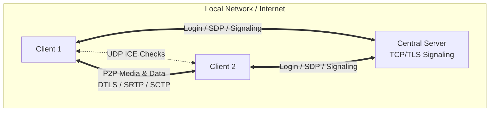
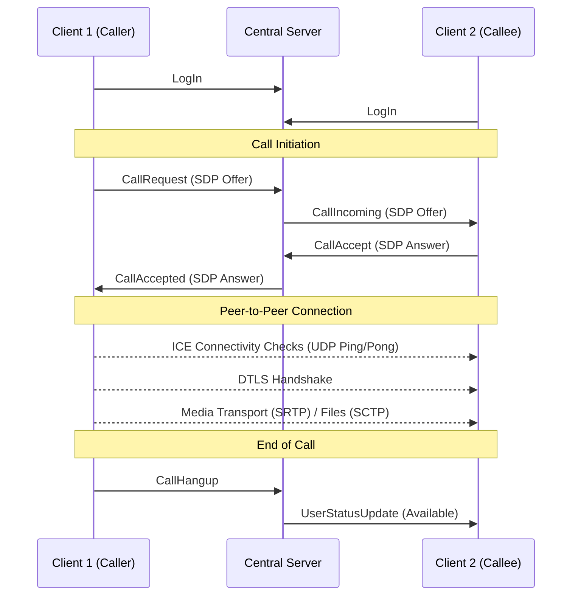
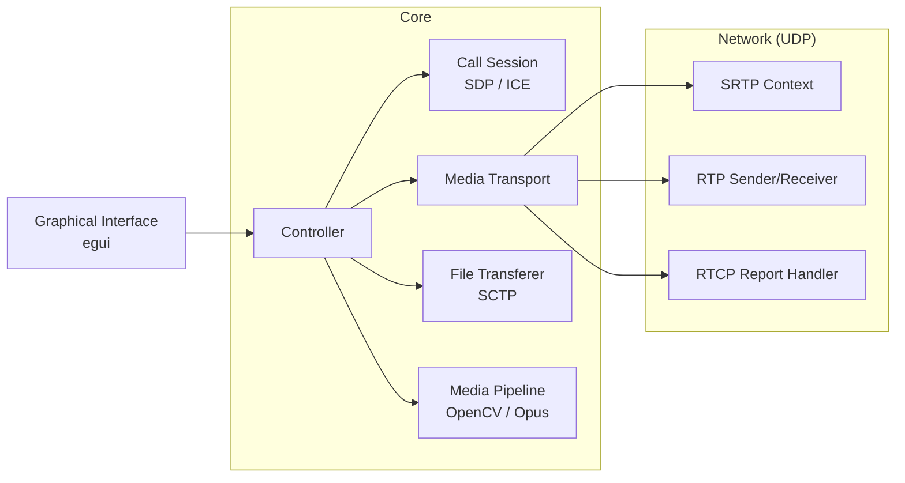

# RoomRTC

Final project for the Programming Workshop (FIUBA) developed by the **RoomRTC** group.

RoomRTC is a video conferencing application written in Rust. It uses a central server for authentication and signaling, and establishes a peer-to-peer (P2P) connection between clients to transport audio, video, and files.

## Quick Start: Build & Run

### Compilation

```bash
cargo build
```

### 1. Running the Server

```bash
cargo run --bin server room_rtc.conf
```

The server uses the configuration from the config file and writes logs to `room_rtc.server.log`.

### 2. Running a Client

```bash
cargo run --bin client room_rtc.conf 127.0.0.1:8080
```

The second argument is the address of the signaling server (`client_server_addr`). The client writes logs to `room_rtc.log`.

### Recommended Order

1. Start the server.
2. Open one or more clients.
3. Register or log in.
4. Select an available user and start the call.

---

## Features

- User registration and login.
- List of available users.
- Peer-to-peer calls with SDP and ICE exchange.
- Real-time audio and video transport.
- Encrypted communication using DTLS/SRTP.
- File transfer during calls via Data Channels over SCTP.
- Desktop graphical interface built with `eframe/egui`.

## Architecture (App Flow)

- **Central Server:** Handles users, login, and signaling over TCP/TLS.
- **Client:** Handles the GUI, audio/video capture, and call control.
- **P2P Connection:** Once the call is negotiated, peers exchange media and data directly over UDP.



## Call Flow

The call establishment flow follows the WebRTC specification adapted to RoomRTC's client-server protocol.



## Client Internal Components

The application is modularly designed, featuring a central controller that orchestrates the UI, sessions, and network transport, using standard library threads instead of async tools like Tokio.



## Requirements

- Stable Rust.
- OpenCV 4 with development headers.
- OpenSSL with development headers.
- `clang`, `llvm`, `pkg-config`.

For Ubuntu/Debian, there is a base script to install environment dependencies:

```bash
bash ./scripts/dependencies.sh
```

Depending on your system, you may also need to install `libssl-dev`.

## Configuration

The `room_rtc.conf` file includes the main sections of the system:

- `[network]`: Sockets and maximum UDP packet size.
- `[media]`: Camera, H.264 video, Opus audio, and RTP parameters.
- `[rtcp]` & `[rtp]`: Reports, timeouts, and packet sizes.
- `[sdp]` & `[ice]`: Session negotiation and candidates.
- `[server]`: Server addresses, TLS files, and users file.
- `[dcep]`: Timeouts for data channels.

The example configuration file already points to:

- Signaling server at `0.0.0.0:8080`.
- Server-client channel at `0.0.0.0:8081`.
- TLS certificates in `tls_server/`.
- Simple user database in `src/server/data.txt`.

## Testing and Quality

```bash
cargo test
```

```bash
cargo clippy --all-targets --all-features
```

## Documentation

```bash
cargo doc --open
```

## Useful Files

- `room_rtc.conf`: Example configuration.
- `src/bin/server/main.rs`: Server entry point.
- `src/bin/client/main.rs`: Client entry point.
- `docs/Informe.md`: Technical project report.

*** Let me know if you'd like to tweak any other part of the documentation!
