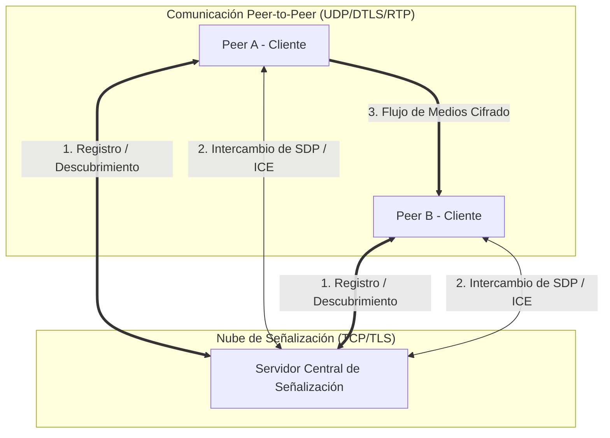
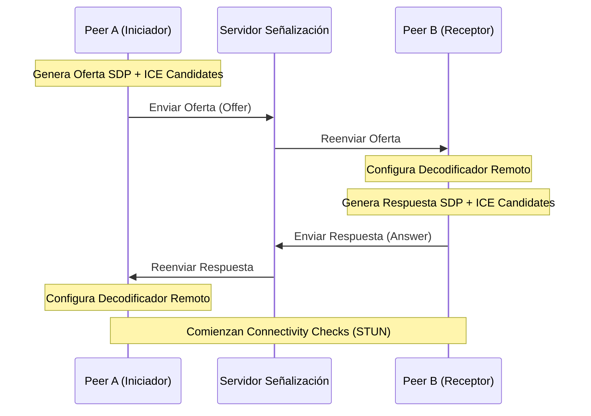
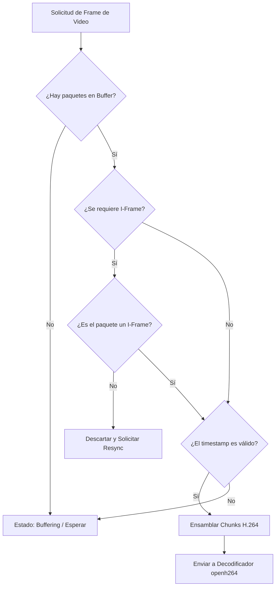
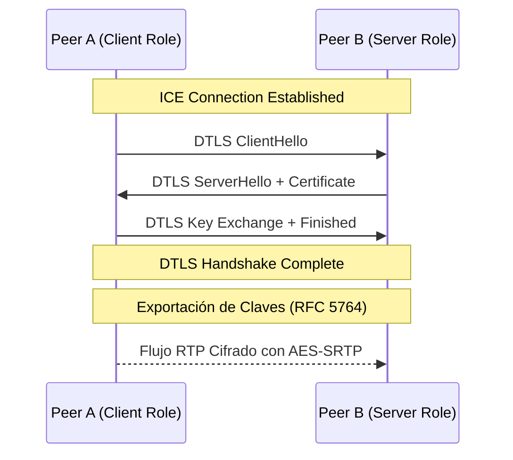
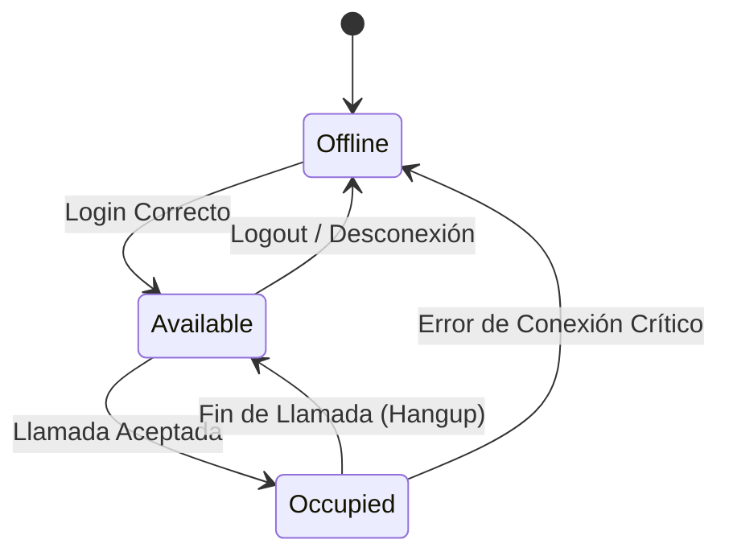

# Proyecto RoomRTC - Informe Final

**Materia:** Taller de Programación (TA045)  
**Cátedra:** Deymonnaz  
**Cuatrimestre:** 2do Cuatrimestre - 2025  
**Grupo:** RoomRTC  

---

## Integrantes

| Padrón | Nombre | Email |
| :--- | :--- | :--- |
| 111753 | Cortez Aguilar, Diego Alejandro | dcortez@fi.uba.ar |
| 111834 | Pérez D'Angelo, Tomás | tperezd@fi.uba.ar |
| 112018 | Molina Buitrago, Marlon Stiven | mmolinab@fi.uba.ar |
| 112034 | Politti, Ignacio | ipolitti@fi.uba.ar |

---

## 1. Introducción

Desde la pandemia de COVID-19 en 2020, el software de videoconferencias ha cobrado una importancia central. En este contexto, la Facultad de Ingeniería de la Universidad de Buenos Aires propuso el desafío de desarrollar una solución propia que cumpla con altos estándares de usabilidad, escalabilidad y eficiencia.

El presente trabajo, titulado **RoomRTC**, consiste en el diseño e implementación de un sistema de videoconferencias desarrollado íntegramente en el lenguaje de programación **Rust**. La elección de este lenguaje responde a la necesidad de garantizar seguridad de memoria (*memory safety*) y alto rendimiento, características críticas para aplicaciones de tiempo real.

### Objetivos del Proyecto
* **Implementación de Protocolos de Red:** Desarrollo desde cero de mecanismos para el establecimiento de sesiones (**SDP**), la conectividad a través de NAT (**ICE**), el transporte de medios en tiempo real (**RTP/RTCP**) y la seguridad en el transporte (**DTLS**).
* **Arquitectura Cliente-Servidor y P2P:** Diseño de un servidor central de señalización para el descubrimiento de pares y una arquitectura distribuida para la transmisión de video.
* **Procesamiento Multimedia:** Captura (OpenCV) y codificación (**H.264** vía openh264) de video en tiempo real.
* **Buenas Prácticas:** Manejo idiomático de errores en Rust, concurrencia segura basada en hilos y canales, y una interfaz gráfica moderna con **eframe/egui**.

---

## 2. Arquitectura del Sistema

El sistema RoomRTC sigue una arquitectura híbrida: **Cliente-Servidor** para la señalización y **Peer-to-Peer (P2P)** para la transmisión de medios.

### Topología de Red



### Modelo de Concurrencia

Se optó por un modelo basado en el **paso de mensajes** (*Message Passing*) utilizando canales `mpsc`. La aplicación cliente utiliza hilos dedicados para evitar bloqueos en la interfaz:

1. **Hilo UI (Main):** Renderizado con `eframe/egui`.
2. **Hilo de Red (Controller):** Gestión de la conexión TCP con el servidor.
3. **Pipeline de Medios:** Hilos independientes para captura, codificación y sockets UDP.

---

## 3. Implementación Técnica

### 3.1 ICE - Interactive Connectivity Establishment

El módulo ICE gestiona el descubrimiento de la ruta de red más eficiente. Soporta candidatos de tipo **Host** (red local) y **Server Reflexive** (vía STUN).

### 3.2 SDP y Negociación

Utilizamos el modelo **Offer/Answer** para acordar códecs y fingerprints de seguridad.



### 3.3 RTP y Jitter Buffer

El núcleo de la transmisión de video utiliza RTP sobre UDP. Para manejar la latencia y el desorden de red, se implementó un **Jitter Buffer**.

#### Lógica de Extracción de Frames



### 3.4 Seguridad: DTLS-SRTP

Para garantizar la privacidad, utilizamos la crate `udp_dtls`. El túnel DTLS se establece después de ICE para derivar las claves de cifrado de los paquetes RTP.



---

## 4. Máquina de Estados de Usuario

El servidor central gestiona la disponibilidad de los usuarios mediante la siguiente lógica de estados:



---

## 5. Instrucciones de Compilación y Ejecución

### Requisitos

* Rust (Stable)
* OpenCV 4.x instalado en el sistema
* Bibliotecas de desarrollo de OpenSSL

### Compilación

```bash
cargo build --release
```

### Ejecución

1. **Iniciar Servidor:**

```bash
./target/release/server /ruta/config_server.conf
```

2. **Iniciar Clientes:**

```bash
./target/release/client /ruta/config_client.conf <IP_SERVIDOR>
```

---

## 6. Bibliografía

* **RFC 3550:** RTP: A Transport Protocol for Real-Time Applications.
* **RFC 8445:** Interactive Connectivity Establishment (ICE).
* **WebRTC for the Curious:** [webrtcforthecurious.com](https://webrtcforthecurious.com/)
* **Rust Documentation:** [doc.rust-lang.org](https://doc.rust-lang.org/)
